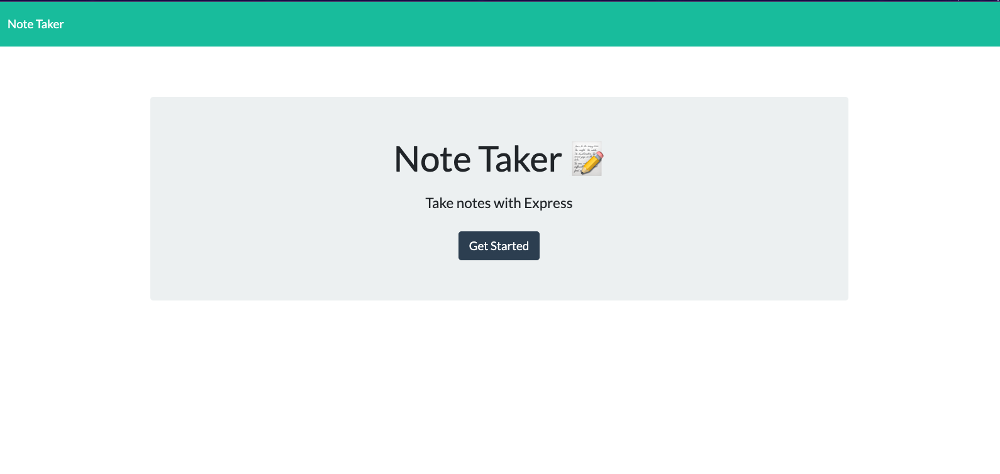
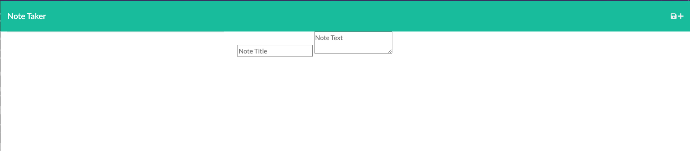

# Note-Taker Application using Express/Node
---
## Table of Contents
* Description
* Installation
* Usage

## Description
I have been motivated to create this project in order to create a suitable note taker that will provide me with more organization. This note taker will allow users to create notes they can refer to in order to create lists and descriptions that will provide information for what needs to be done or something discussed and needs to be remembered. Through this project, I am learning how to use Node and Express to create a program that will create notes to store information. This project stands out through the ways I have utilized certain code to create a functioning note-taking app. Precisely, we have used GET, POST, DELETE, and PUT.

## Installation
In order to install this project, you need to create a port where your computer will host the site, and then from there, open the application , and start taking/adding notes.

## Usage

